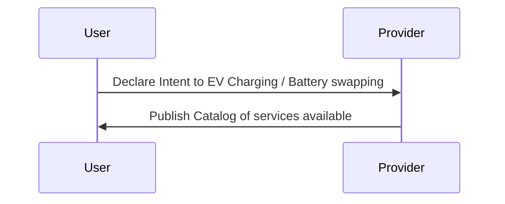
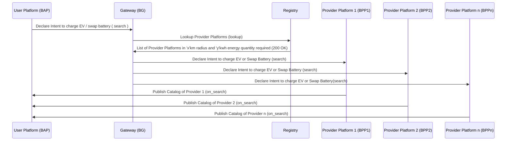
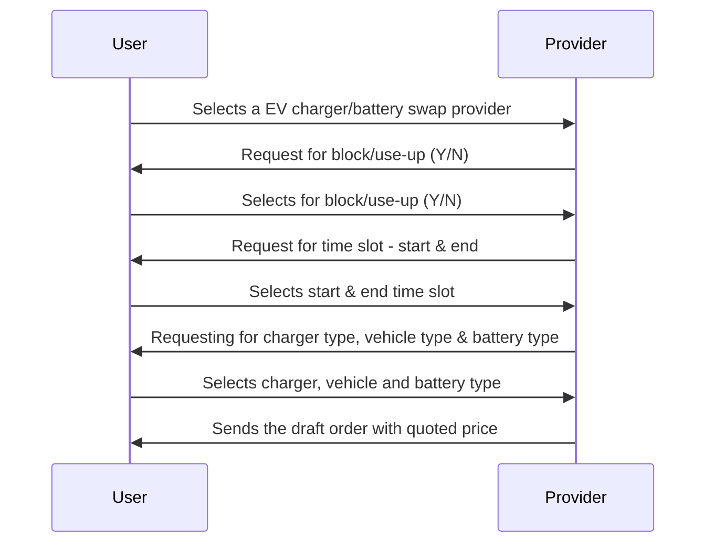
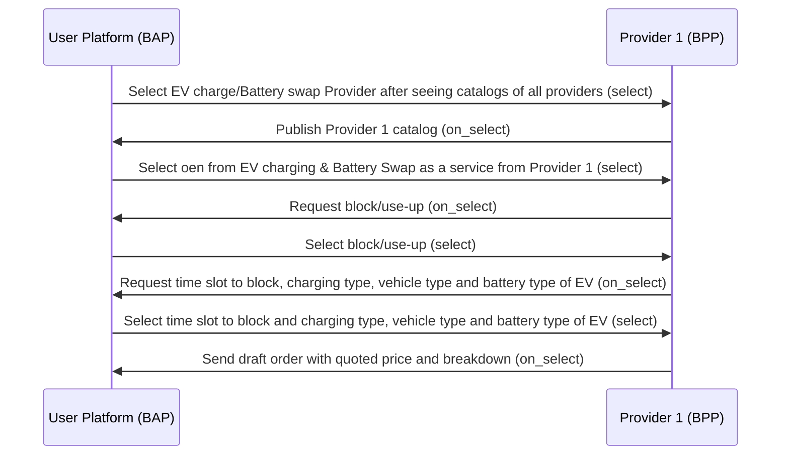
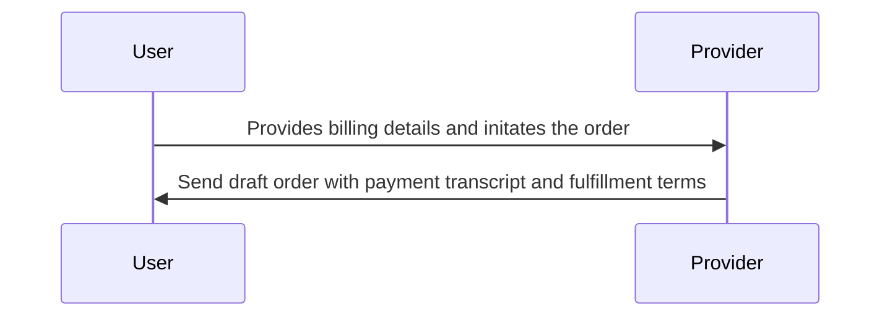
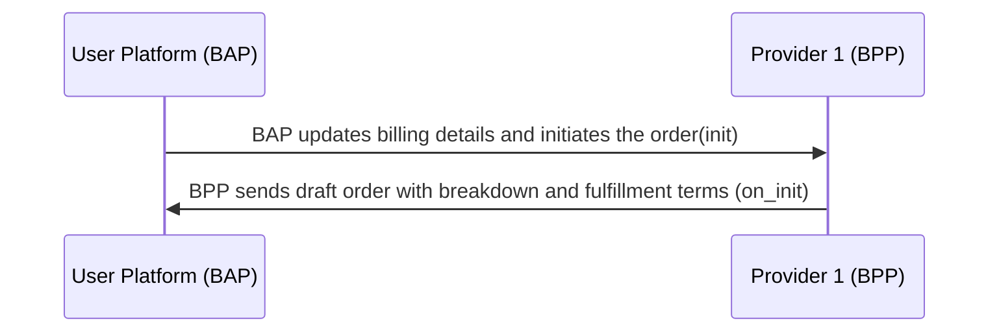
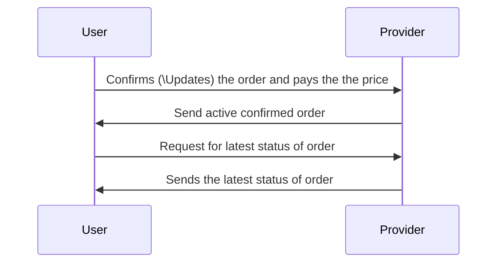
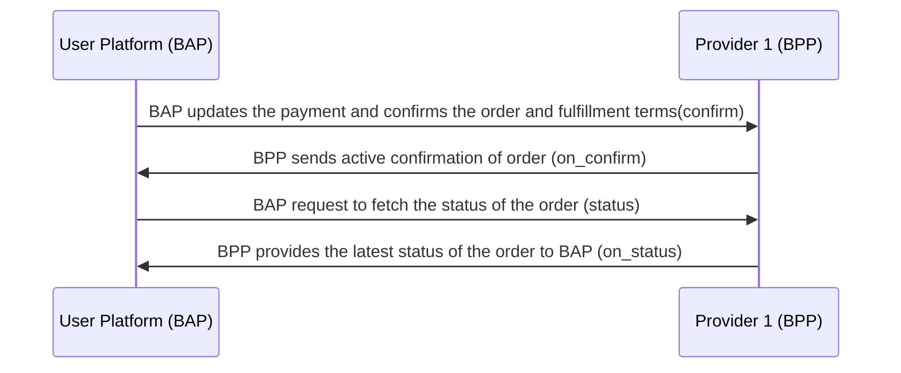

# EV Charging and Battery Swapping Application Workflow #1

## Overview
This document outlines the workflow for Electric Vehicle (EV) Charging and Battery Swapping using the DENT Protocol. The workflow includes interactions between the provider and the User for search, select, block, and completing the session.

Bear in mind that this is just an example workflow for a simple EV Charing and Battery swap workflow between a `User` and a `Provider`.
(Note: Here, User -> Electric Vehicle Owner/User and Provider -> EV Chraging Provider or Battery Swapping Service Provider)

A typical workflow for EV Charging & Battery Swapping consists of the following steps:

#### Step 1: User searches for EV Chargers
The user provides current location and specific requirements (These requirements will act as filters for EV Charging Providers such as amount of energy user needs in kwh) to find the nearest EV Chargers to charge his/her EV

#### Step 2: Provider sends catalogs of EV Chargers nearby
The provider platform (BPP) sends all the nearby Providers and their catalogs to the user.
The catalog will consist of all the services provided by the providers, such as charging types, connector types and battery swapping services etc.,

#### Step 3: User selects EV Charger or Battery Swapping Service
Selects the provider which satisfies user requirements.
In this stage, the user may select additional features such as:
1. User can select his required services (such as EV Charging or Battery Swapping) from the catalog of provider
2. User selects the vehicle type of his EV (2-wheeler/3-wheeler/4-wheeler), selects the battery type (such as log9 battery), and also provides the EV's information.
3. User can block/reserve the charger/swap service for a certain time slot, along with the start and duration times of the session.
4. User can select the charger type he wants to use such as A.C. or D.C. and Connector types like CCS2 etc.,
5. User can select quantity of energy required in units of kwh.

#### Step 4: Provider sends quoted price
The provider will receive the order based on the user requirements.
The user gets the quoted price, including the breakdown of the price details.
The breakdown should include:
  - Tariff per unit (i.e., INR/KWh), the tariff per unit might change by the service type, charger type and location of Energy Charger Provider
  - (or) Price for Battery Swapping
  - Price for reservation
  - Taxes

#### Step 5: User initiates the order
User initializes the order by providing billing details. 
Here, the user will provide their `Name`, `Email ID` and `Phone Number` and updates the payment details

#### Step 6: Provider sends draft order
The provider sends the draft order with the payment and fulfilment terms to the user-side.
Based on how much units of Electrical Energy user used during charging as tariff_per_unit as already mentioned above in INR/KWh or the Price for Battery Swapping Service
If the user also done the reservation/block the transaction includes the price for block/use-up price as well 
The tariff_per_unit might change with the charger type as we know that A.C. charger type has different price compared to D.C. charger type.

#### Step 7: User confirms the order
User sees the draft order and confirms it by agreeing to the payment and fulfilment terms and conditions
The confirm status will sent to the provider saying that user has paid the price and satisfied the fulfillment terms

#### Step 8: Provider sends the order activation
The provider will activates the order and informs user that the order is activated

#### Step 9: User checks the status of the order
The user requests to check the updates/status of his/her order

#### Step 10: Provider sends the status of the order
The provider will send the order updates with current status to the user

## Search (Searching for EV Chargers)
1. The user declares the intent for EV Charging/Battery Swap to the providers
2. Providers publish the catalog of their services

### User-side Actions
A EV user can declare their intent for EV charging in many ways like:
- Searching for EV Charging/Battery Swap Providers based on current location of user
- Searching for EV Charging Providers based on quantity required
- Searching for Battery Swap Providers based on battery type
- Searching for EV Charging/Battery Swap Providers based on Name/Code of provider
- Searching for EV Charging/Battery Swap Providers based on ratings
- View list of energy sources, such as EV chargers, Solar Farms providing EV charging, Houses providing EV charging, Battery Swap Providers etc.
- Viewing the catalog/details of services provided by a particular charging/Battery Swap provider

### Provider-side Actions
In this interaction, the Provider publishes their catalog of services and products. A Provider can publish various types of catalogs like
- Publish list of energy sources and EV chargers including Solar Farms providing EV charging, Houses, Battery Swap Providers etc.
- Publish list of provders in 5Km radius of user
- Publish list of provders with the requested Charing types/Connector types/Battery types
- Publish catalog/details of services provided by providers
- Publish catalog of services provided by a particuar provider
  
### Logical Workflow

### Beckn Protocol API Workflow
In beckn protocol, the search intent generated by the EV User Platform (BAP) is typically published on the gateway (BG) that broadcasts the intent to multiple Provider platforms (BPPs). Each of the BPPs return their catalogs directly to the BAP via asynchronous callbacks. The workflow for that is shown below.

## Select and Book Charging
1. User selects a EV Charge/ Battery Swap Provider from the list which satisfies the requirements
2. The provider sends the draft order with the quoted price to the User
   
### User-side Actions
- Selecting EV Charge/Battery Swap Provider(s) after viewing catalogs
- Selecting to block/use-up charger (or) not. (Y/N) 
- Selecting start and end time for block/use-up of charger/swap service
- Selecting charger type (A.C./D.C.) and connector type
- Selecting vehicle type (2-wheeler, 3-wheeler, 4-wheeler) and its battery type

### Provider-side Actions
- Receive user's selection
- Requesting for block/use-up charger (Y/N)
- Requesting for time slot
- Requesting for charger type, connecter type, vehicle type and battery type
- Provider sends draft order for the selected EV charge with quoted price
- The price includes with a breakdown of `tariff_per_unit` (or) `price for battery swap`, `Reservation Price`, `taxes`

### Logical Workflow
The below diagram illustrates the logical interactions between a EV user and Provider during the Selecting service/product stage

### Beckn Protocol API Workflow

## Order Initialization
In this stage, the User provides the required information and initiates the order

### User-side Actions
- User provides the billing details `Name`, `Email ID` and `Phone Number`
- User updates the payment details and initiates the order
  
### Provider-side Actions
- Request for billing details
- Receive billing details from the user
- Send draft order with payment and fulfillment terms

### Logical Workflow

### Beckn Protocol API Workflow

## Fulfillment (Payment and Order Confirmation)
User will check the order details and confirms the order with payment (might also update the order)
Post payment user will activates the confirmed order

### User-side Actions
- Confirms(\updates) the order by agreeing to fulfillment terms

### Provider-side Actions
- Receive order confirmation from the user
- Send active confirmed order to the user

## Status Updates and Monitoring

### User-side Actions

- Request to fetch the latest status of the order

#### Provider-side Actions

- Provide the latest status of the order to the user

### Logical Worklow

### Beckn API Workflow

