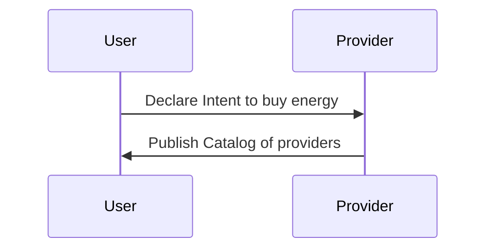
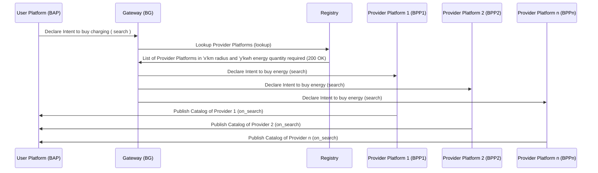
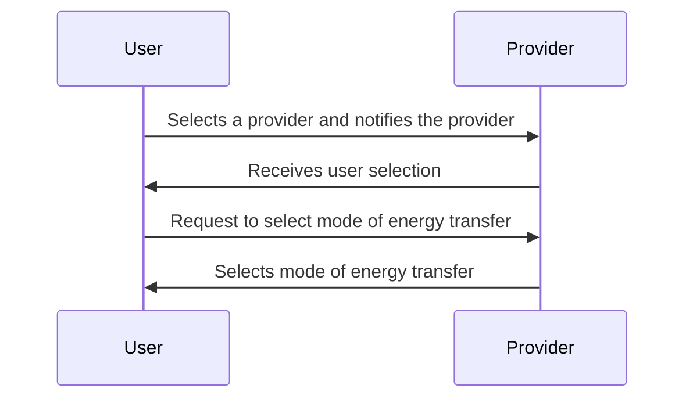
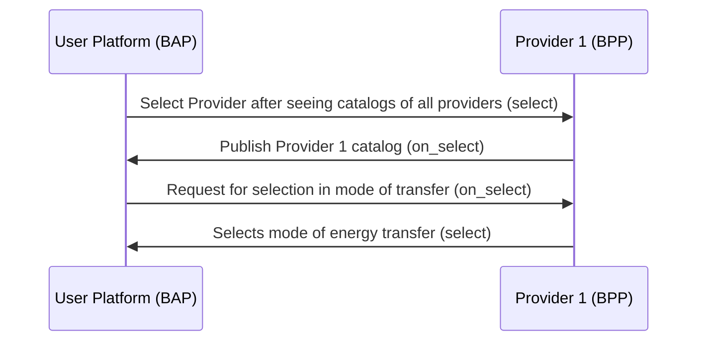
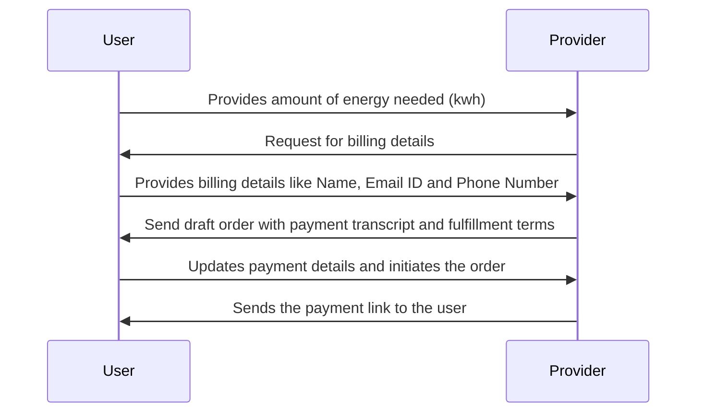
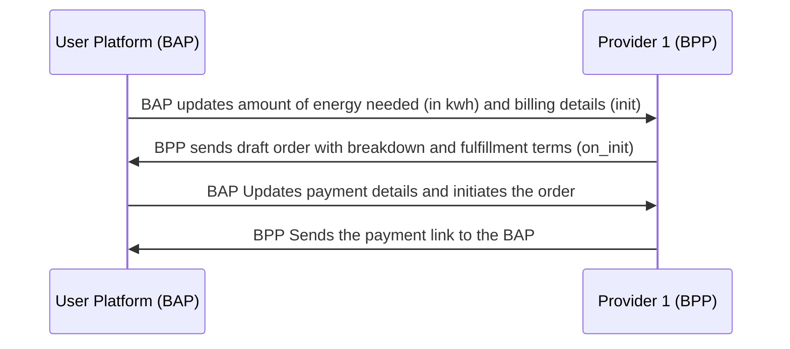
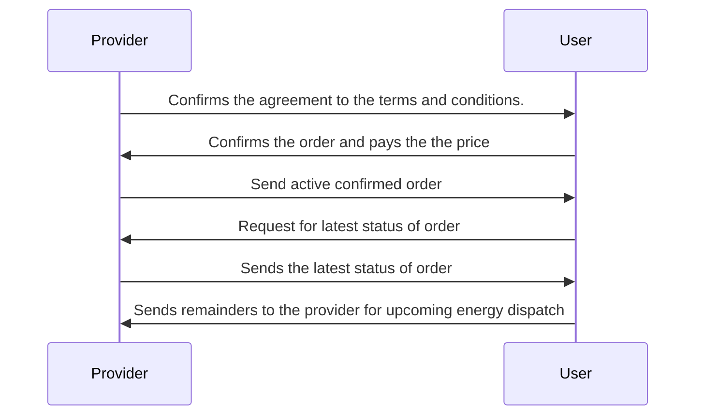
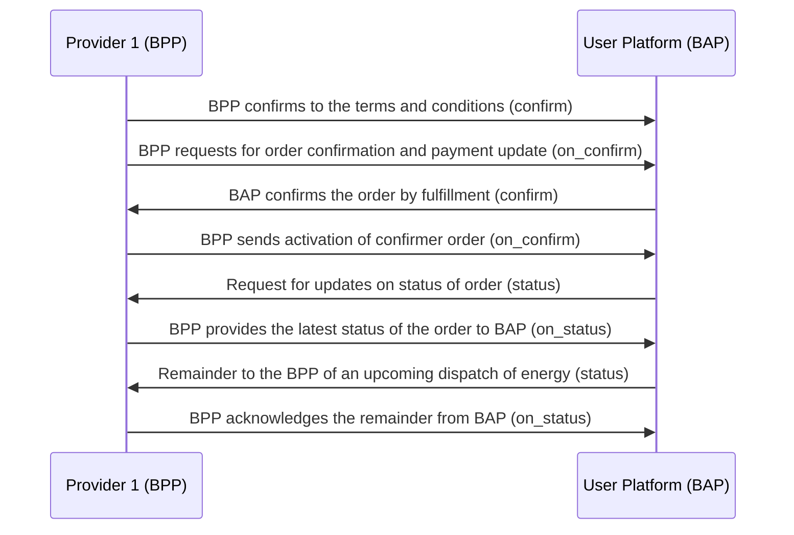

# General Energy Transaction Workflow #1

## Overview
This implementation guide outlines the energy transaction process where Sheru (Energy Aggregator) purchases energy from individuals or crowds using the Beckn Protocol. The guide provides step-by-step instructions on how Sheru interacts with the Unified Energy Interface (UEI) to discover energy sources, select providers, initiate transactions, confirm orders, and monitor status updates.

Bear in mind that this is just an example workflow for a simple Energy Transaction, where Sheru buys the Energy from the individuals/crowd using UEI.

(Note: Here, User -> Sheru and Provider -> Individual/Crowd who is providing energy.)

A typical workflow for EV Charging & Battery Swapping consists of the following steps:

#### Step 1: Discovery of Electricity
The user provides the amount of energy needed in kwh (which will act as a filter for the search).

#### Step 2: Provider sends catalogs of EV Chargers nearby
The UEI sends all the catalogs to the user.
The list of catalogs consists of:
   - Individuals/Crowds from whom energy can be bought.
   - Locations where energy can be purchased.
   - Available areas/locations for energy purchases

#### Step 3: Sheru selects an Provider
User selects a suitable individual/crowd provider from the provided catalogs.
The UEI notifies the chosen individual that Sheru intends to buy energy

#### Step 4: Provider selects mode of Energy Transfer
The provider will select the mode of energy transfer
1. Automatic Dispatch
- Complete control of discharge is given to the UEI/DENT Protocol.
2. Manual Dispatch
- Commit to providing the required energy; penalties for non-compliance are applicable.

#### Step 5: Initiating the transaction
The user initializes the order by declaring the required amount of energy in units

#### Step 6: Provider sends draft order
The provider sends the draft order with the payment and fulfillment terms to the user's side.
UEI calculates a quote and sends the payment amount based on tariffs and taxes
Payment link is sent to user for completing the payment

#### Step 7: Provider confirms to satisfy the fulfillment terms
If Provider selects Automatic Dispatch, no additional confirmation is needed.
If Provider selects Manual Dispatch:
  - Provider confirms commitment to fulfillment terms.
  - If energy provision fails, a penalty is applicable.
Upon provider's confirmation, UEI notifies Sheru and requests payment
#### Step 8: User activates order by payment
The user makes the payment and sends a confirmation to UEI.
UEI replies with a confirmation of fulfillment and payment status.
The UEI will activate the order and informs user that the order is activated

#### Step 9: User checks the status of the order
The user requests to fetch the order status/amount of dispatched energy 

#### Step 10: UEI sends the status of the order
UEI provides status updates for the order.
UEI can send reminders to the provider for upcoming energy dispatch (manual or automatic).

## Search (Searching for Provider)
1. The user declares the intent for buying energy to the providers
2. Providers publish the catalogs

### User-side Actions
A user can declare their intent for buying energy in many ways like:
- Searching for  Providers based on location
- Searching for Providers based on quantity required (energy in kwh)
- Searching for Providers based on Name or Code of provider
- Searching for Providers based on ratings
- Viewing the catalog/details of services provided by a particular charging/Battery Swap providers

### Provider-side Actions
In this interaction, the Provider publishes their catalog. The catalog mainly consits of :
- Individuals or crowds from whom energy can be bought.
- Locations where energy can be purchased (Address)
- Full Name, Phone Number, Email-ID
  
### Logical Workflow

### Beckn Protocol API Workflow
In beckn protocol, the search intent generated by the User Platform (BAP) is typically published on the gateway (BG) that broadcasts the intent to multiple Provider platforms (BPPs). Each of the BPPs returns their catalogs directly to the BAP via asynchronous callbacks. The workflow for that is shown below.

## Select and On_Select
1. User selects a Provider from the list which satisfies the requirements
2. The BAP notifies the chosen Provider and requests the provider to select the mode of energy transfer
   - Automatic Dispatch
   - Manual Dispatch
   
### User-side Actions
- Selecting Provider after viewing catalogs
- BAP notifies the providr and requests Provider to select the mode of energy transfer

### Provider-side Actions
- Receive user's selection
- Selecting mode of energy transfer (Manual or Automatic Dispatch)

### Logical Workflow
The below diagram illustrates the logical interactions between a User and Provider during the Selection stage

### Beckn Protocol API Workflow

## Order Initialization
In this stage, the User provides the required information and initiates the order

### User-side Actions
- User provides the value of the required amount of energy in kwh 
- User provides the billing details `Name`, `Email ID` and `Phone Number`
- User updates the payment details and initiates the order
  
### Provider-side Actions
- Request for billing details
- Receive billing details from the user
- Send draft order with payment and fulfillment terms
- Sends the payment link to the user along with breakdown of price and taxes

### Logical Workflow

### Beckn Protocol API Workflow

## Fulfillment (Payment and Order Confirmation)
Provider has to give confirmation of the fulfillment terms if he chooses Manual Dispatch 
The, the User will check the order details and confirm the order with payment (might also update the order)
Post payment UEI will activate the confirmed order

### User-side Actions
- Confirms(\updates) the order by checking the order details and agreeing to fulfillment terms

### Provider-side Actions
- If provider chosen Manual Dispatch: Provider has to confirm that he accepts the terms and conditions upon that only user can confirm the order and satisfy the fulfillment terms.
- Receive order confirmation from the user
- Send active confirmed order to the user

## Status Updates and Monitoring

### User-side Actions

- Request to fetch the latest order status or amount of dispatched energy.
- Sends remainders to the provider for upcoming energy dispatch (manual or automatic)

#### Provider-side Actions

- Provide the latest status of the order to the user
### Logical Worklow

### Beckn API Workflow

### Example Scenarios for entire workflow

#### Example 1

- Sheru searches for 100 kWh of energy. (search)
- UEI Protocol provides a list of catalogs including individuals/crowds. (on_search)
- Sheru selects an individual for energy purchase. (select)
- Individual selects Automatic Dispatch. (on_select)
- Sheru declares the requirement (100 kWh) (init).
- UEI Protocol BPP calculates the quote and sends the payment amount (on_init).
- Sheru confirms the order (confirm).
- UEI notifies Sheru about order confirmation (on_confirm).
- Energy is dispatched after confirmation.
- Sheru checks the status of the dispatched energy (status api).

#### Example 2
- Sheru needs 200 kWh of energy.
- UEI/DENT Protocol provides a list of catalogs including individuals/crowds.
- Sheru selects an individual for energy purchase.
- Individual selects Manual Dispatch.
- Sheru declares the requirement (200 kWh) (init).
- UEI/DENT Protocol BPP calculates the quote and sends the payment amount (on_init).
- Individual confirms commitment to fulfillment terms (confirm).
- UEI notifies Sheru about individual's confirmation (on_confirm).
- Sheru pays the bill and confirms the payment (confirm).
- UEI/DENT Protocol BPP confirms fulfillment and payment (on_confirm).
- Sheru checks the status of the dispatched energy (status api).
