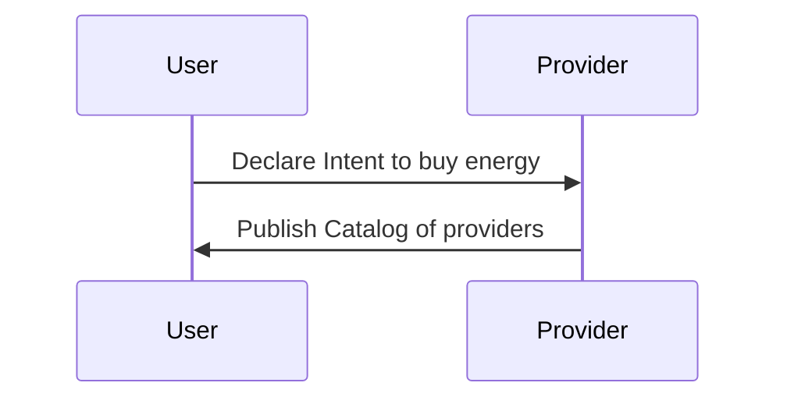
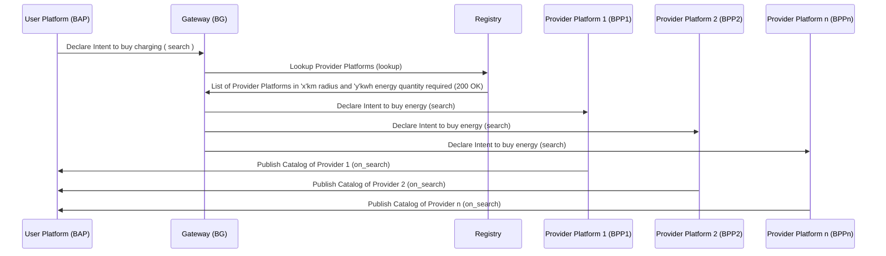
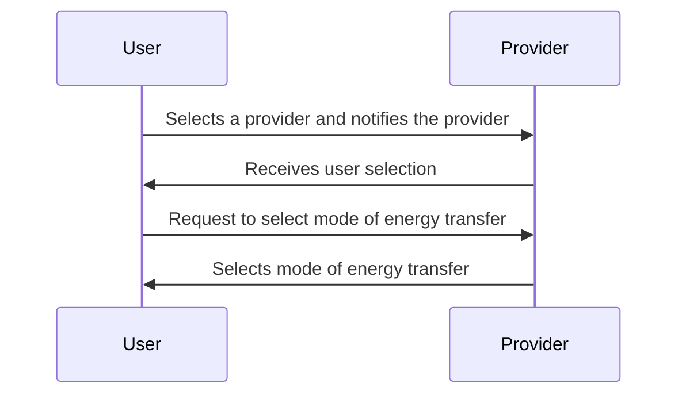
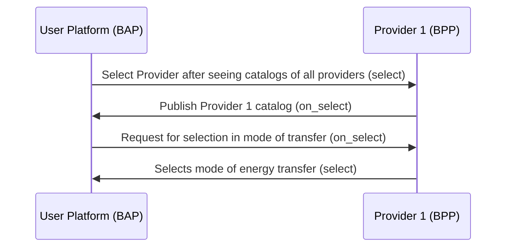
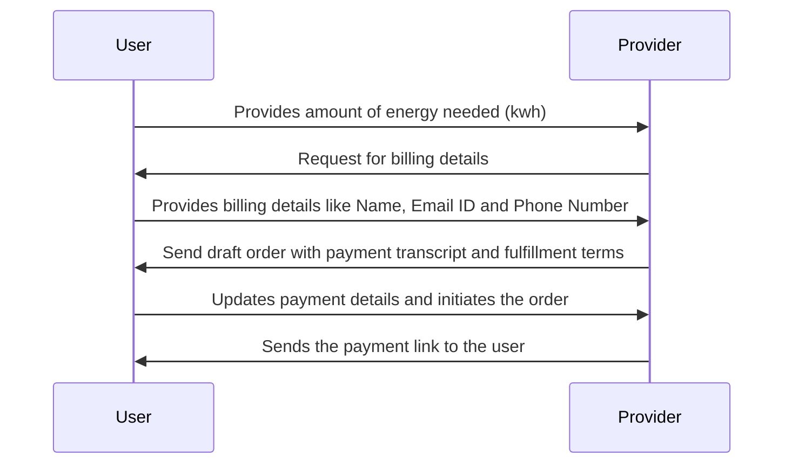
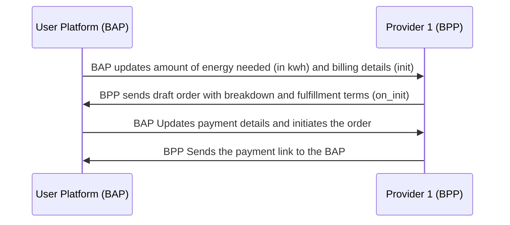
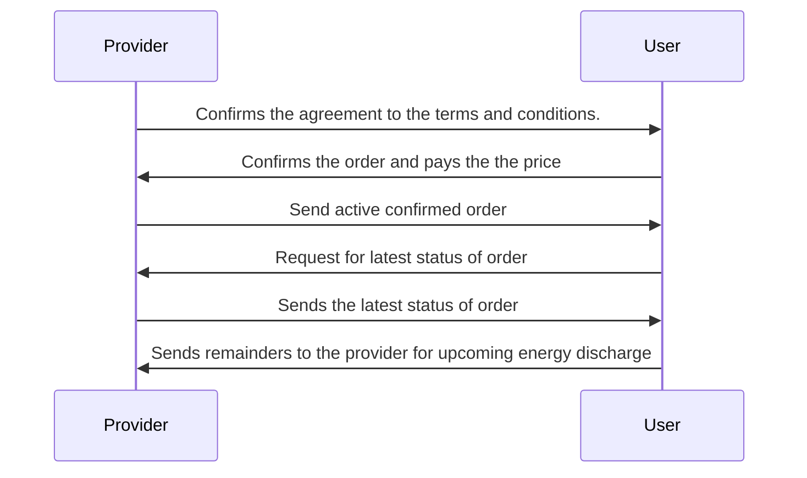

# General Energy Transaction Workflow #1

## Overview
This implementation guide outlines the energy transaction process where Sheru (Energy Aggregator) purchases energy from individuals or crowds using the Beckn Protocol. The guide provides step-by-step instructions on how Sheru interacts with the Unified Energy Interface (UEI) to discover energy sources, select providers, initiate transactions, confirm orders, and monitor status updates.

## Important NOTE :
- During Auto Discharge the provider will sign a consent form such that upon the initiation of the energy transaction, access to discharging/dischargeing the energy from the battery or source of energy is completely given to UEI, until the transaction is completed.
- Since, only UEI has the control/access to discharge the battery or energy source, there is no need ro use of penalty.
- During Manual Discharge, the control/access is not given to UEI; rather, the provider him/herself will discharge/discharge the energy.
- In this case, if the provider has not satisfied the terms he/she agreed upon during the transaction, then the provider has to pay the penalty for the amount of energy he/she was not able to provide.
- The form of energy discharging, either through Auto-Discharging or Manual-Discharging is completely the provider's choice, which is a `pre-select` feature for the provider.

Bear in mind that this is just an example workflow for a simple Energy transaction where Sheru buys the Energy from the individuals/crowd using UEI.

(Note: Here, User -> Sheru and Provider -> Individual/Crowd who is providing energy and UEI -> Unified Energy Interface)

A typical workflow for EV Charging & Battery Swapping consists of the following steps:

#### Step 1: Discovery of Electricity
- The user selects whether they want providers who agree to Auto-Discharge or Manual-Discharge (which will act as a filter for search)
   1. Automatic discharge
      - Complete control of discharge is given to the UEI.
   2. Manual Discharge
      - Commit to providing the required energy; penalties for non-compliance are applicable.
- The user provides the amount of energy needed in kWH (which will act as a filter for the search).
  
#### Step 2: Provider platform sends catalogs of Individuals nearby
The UEI sends all the catalogs to the user.
The list of catalogs consists of:
   - Individuals/Crowds from whom energy can be bought (Name, Phone Number, Email ID)
   - Mode of Energy discharge provider has agreed upon (i.e, Automatic discharge / Manual Discharge)
   - Available areas/locations for energy purchases

#### Step 3: Sheru selects a Provider
The user selects a suitable individual/crowd provider from the list of provided catalogs.
The UEI notifies the chosen individual that Sheru intends to buy energy

#### Step 4: Provider sends the draft order with quoted price
The provider acknowledges the notification sent by UEI for selling energy
The provider will receive the order based on the user's requirements. The user gets the quoted price, including the breakdown of the price details. The breakdown should include:
   1. Tariff per unit (i.e., INR/KWh), might change based on location of Energy Provider
   2. Taxes: CGST & SGST

#### Step 5: Initiating the transaction
The user initializes the order by declaring the required amount of energy in units
The UEI also requests that the provider accept the consent form (i.e., a check box) to take control/access to discharging the battery/energy source during Auto Discharge (in the case of Auto-Discharge Providers)

#### Step 6: Provider sends draft order
[In case of Auto-discharge.] The provider signs the consent letter (i.e., ticks the check box), that implies the provider is giving control to UEI for discharging their battery or energy source.
The provider sends the draft order with the payment link and fulfillment terms to the user's side.
UEI calculates a quote and sends the payment amount based on tariffs and taxes
A payment link is sent to user to complete the payment

#### Step 7: Provider accepts the terms and conditions
Provider confirms to satisfy the fulfillment terms and conditions (confirm)
If Provider selects Automatic discharge, no additional confirmation is needed.
If Provider selects Manual Discharge:
  - Provider confirms commitment to fulfillment terms.
  - If energy provision fails, a penalty is applicable.

#### Step 8: User confirms the order by payment fulfillment
User sees the confirm status of the provider for the fulfillment terms and conditions. (on_confirm)
Upon that, the user pays the quoted price for the draft order and activates the order by agreeing to the payment 
The confirm status will sent to the provider through UEI, saying that user has paid the price and satisfied the fulfillment terms (confirm)
The UEI will activate the order after fulfillment of payment and confirmation of user and provider, respectively. (on_confirm)

#### Step 9: User checks the status of the order
The user requests to fetch the order status/amount of discharged energy 

#### Step 10: UEI sends the status of the order
UEI provides status updates for the order (i.e., the amount of energy has been discharged so far).
UEI can send reminders to the provider for upcoming energy discharges (manual or automatic).

## Search (Searching for Provider)
1. The user declares the intent for buying energy to the providers
2. Providers publish the catalogs

### User-side Actions
A user can declare their intent to buy energy in many ways, like:
- Searching for Providers based on location
- Searching for Providers based on mode fo discharge (Automatic/Manual)
- Searching for Providers based on quantity required (energy in kwh)
- Searching for Providers based on Name or Code of provider
- Searching for Providers based on ratings
- Viewing the catalog/details of services provided by a particular providers

### Provider-side Actions
In this interaction, the Provider publishes their catalog. The catalog mainly consits of :
- Individuals or crowds from whom energy can be bought.
- Locations where energy can be purchased (Address)
- Full Name, Phone Number, Email-ID
  
### Logical Workflow

### Beckn Protocol API Workflow
In beckn protocol, the search intent generated by the User Platform (BAP) is typically published on the gateway (BG) that broadcasts the intent to multiple Provider platforms (BPPs). Each of the BPPs returns their catalogs directly to the BAP via asynchronous callbacks. The workflow for that is shown below.

## Select and On_Select
1. User selects a Provider from the list which satisfies the requirements
2. The BAP notifies the chosen Provider and requests the provider to select the mode of energy transfer
   - Automatic discharge
   - Manual Discharge
   
### User-side Actions
- Selecting Provider after viewing catalogs
- BAP notifies the providr and requests Provider to select the mode of energy transfer

### Provider-side Actions
- Receive user's selection
- Selecting mode of energy transfer (Manual or Automatic discharge)

### Logical Workflow
The below diagram illustrates the logical interactions between a User and Provider during the Selection stage

### Beckn Protocol API Workflow

## Order Initialization
In this stage, the User provides the required information and initiates the order

### User-side Actions
- User provides the value of the required amount of energy in kwh 
- User provides the billing details `Name`, `Email ID` and `Phone Number`
- User updates the payment details and initiates the order
  
### Provider-side Actions
- Request for billing details
- Receive billing details from the user
- Send draft order with payment and fulfillment terms
- Sends the payment link to the user along with breakdown of price and taxes

### Logical Workflow

### Beckn Protocol API Workflow

## Fulfillment (Payment and Order Confirmation)
Provider has to give confirmation of the fulfillment terms if he chooses Manual Discharge 
The, the User will check the order details and confirm the order with payment (might also update the order)
Post payment UEI will activate the confirmed order

### User-side Actions
- Confirms(\updates) the order by checking the order details and agreeing to fulfillment terms

### Provider-side Actions
- If provider chosen Manual Discharge: Provider has to confirm that he accepts the terms and conditions upon that only user can confirm the order and satisfy the fulfillment terms.
- Receive order confirmation from the user
- Send active confirmed order to the user

## Status Updates and Monitoring

### User-side Actions

- Request to fetch the latest order status or amount of discharged energy.
- Sends remainders to the provider for upcoming energy discharge (manual or automatic)

#### Provider-side Actions

- Provide the latest status of the order to the user
### Logical Worklow

### Beckn API Workflow

### Example Scenarios for entire workflow

#### Example 1

- Sheru searches for 100 kWh of energy. (search)
- UEI Protocol provides a list of catalogs including individuals/crowds. (on_search)
- Sheru selects an individual for energy purchase. (select)
- Individual selects Automatic discharge. (on_select)
- Sheru declares the requirement (100 kWh) (init).
- UEI Protocol BPP calculates the quote and sends the payment amount (on_init).
- Sheru confirms the order (confirm).
- UEI notifies Sheru about order confirmation (on_confirm).
- Energy is discharged after confirmation.
- Sheru checks the status of the discharged energy (status api).

#### Example 2
- Sheru needs 200 kWh of energy.
- UEI/DENT Protocol provides a list of catalogs including individuals/crowds.
- Sheru selects an individual for energy purchase.
- Individual selects Manual Discharge.
- Sheru declares the requirement (200 kWh) (init).
- UEI/DENT Protocol BPP calculates the quote and sends the payment amount (on_init).
- Individual confirms commitment to fulfillment terms (confirm).
- UEI notifies Sheru about individual's confirmation (on_confirm).
- Sheru pays the bill and confirms the payment (confirm).
- UEI/DENT Protocol BPP confirms fulfillment and payment (on_confirm).
- Sheru checks the status of the discharged energy (status api).
