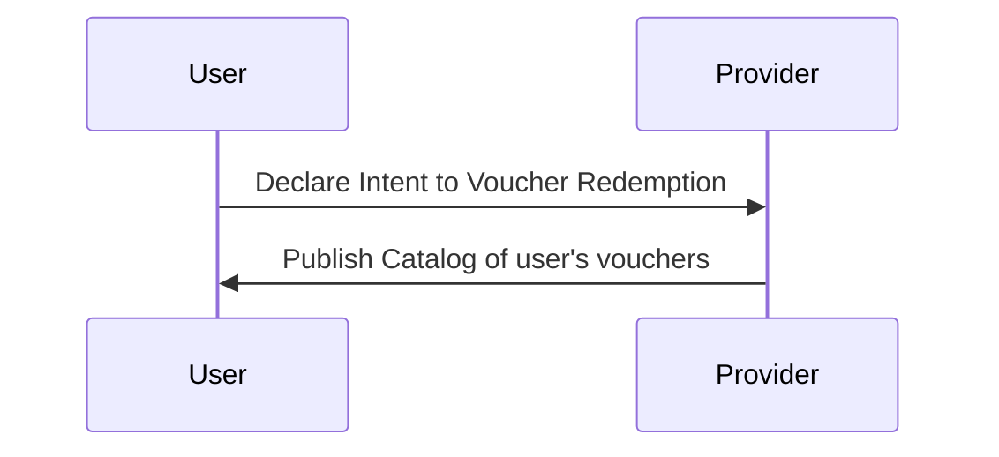
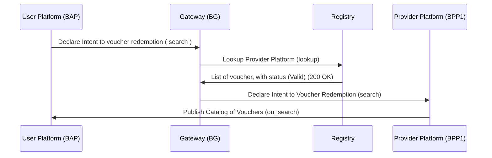
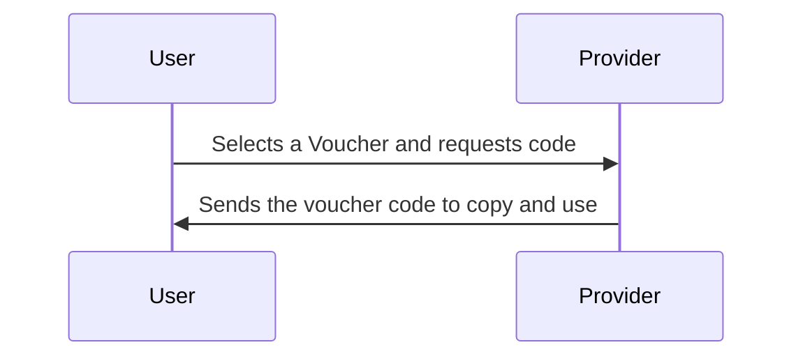
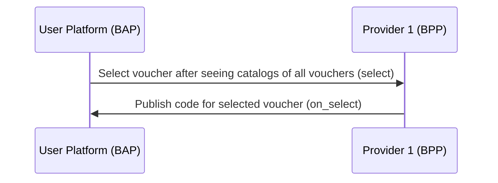
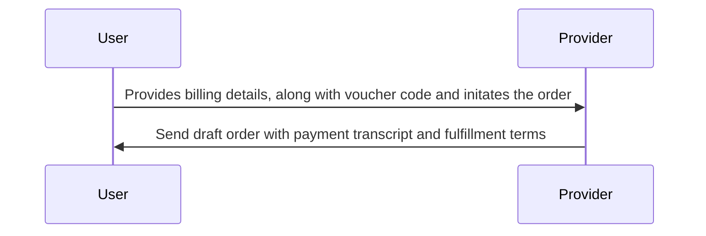
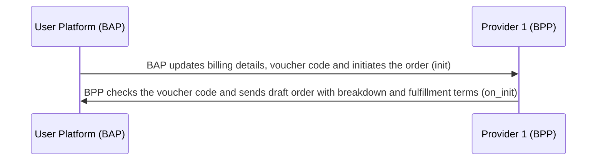
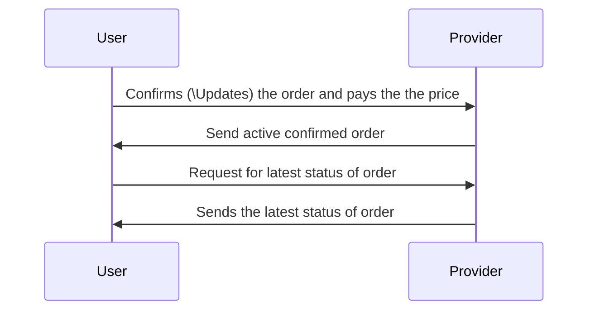
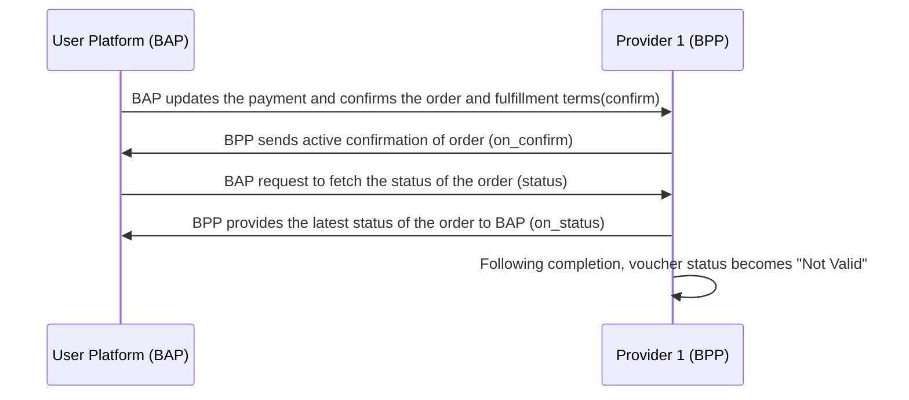

# Voucher Redemption Implementation Guide

## Overview
This implementation guide outlines the process of voucher redemption within the context of the Beckn Protocol. Voucher redemption allows users to utilize vouchers for energy transactions, enhancing the user experience and promoting business offerings. This guide provides step-by-step instructions on how users can explore, select, and redeem vouchers, along with the interaction between the user and the energy provider.

A typical workflow for Voucher Redemption consists of the following steps:

#### Step 1: User searches for vouchers
The user searches for his or her vouchers which are available for transactions.

#### Step 2: Provider sends catalog of vouchers available
The provider platform (BPP) sends all user's vouchers which has valid status

Note: 
1. Each voucher can only bee used once, if the voucher has been used once then its status will be labelled as "Not Valid", which means it is not valid for future transactions
2. If a voucher is not used at all, then it is ready for redemption, so the status will be "Valid".

#### Step 3: User selects a voucher
User selects the desired voucher for redemption.

#### Step 4: Provider sends Voucher code
The provider sends the redemption code to the user.
The user will copy the code for using it.

#### Step 5: User initiates the order
User copies the code and pastes it along with billing details (`Name`, `Phone number`, `email`) to initialize the order.

#### Step 6: Provider sends draft order with wuoted price
Provider sends a draft order with payment and fulfillment terms, along with a breakdown.
  - Energy used
  - Tariff_per_unit
  - Price for Energy used
  - Reservation charges
  - Voucher Redemption Discount
  - Taxes
  - Total amount

#### Step 7: User confirms the order
User sees the draft order and confirms it by agreeing to the payment and fulfilment terms and conditions
The confirm status will sent to the provider saying that user has paid the Total Amount and satisfied the fulfillment terms

#### Step 8: Provider sends order activation:
The provider will activates the order and informs user that the order is activated

#### Step 9: User checks the status of the order
The user requests to check the updates/status of his/her order

#### Step 10: Provider sends the status of the order
The provider will send the order updates with current status to the user
- Once the transaction is completed by default the status of the voucher will become "Not Valid"

## Search (Searching for vouchers)

### User-side Actions
The user declares the intent for voucher redemption to the provider platform

### Provider-side Actions
In this interaction, the Provider platform publishes the user's vouchers, which are valid and available for transaction.
Here, the status will act as a filter during the search of vouchers

### Logical Workflow

### Beckn Protocol API Workflow
In beckn protocol, the search intent generated by the EV User Platform (BAP) is typically published on the gateway (BG) that broadcasts the intent to multiple Provider platforms (BPPs). Each of the BPPs return their catalogs directly to the BAP via asynchronous callbacks. The workflow for that is shown below.

## Select Voucher
   
### User-side Actions
User selects a voucher from the list which satisfies the requirements

### Provider-side Actions
- Receive user's selection
- Sends the voucher code for the user to copy and use the voucher

### Logical Workflow
The below diagram illustrates the logical interactions between a EV user and Provider during the Selecting service/product stage

### Beckn Protocol API Workflow

## Order Initialization
In this stage, the User provides the required information and initiates the order

### User-side Actions
- User provides the billing details `Name`, `Email ID`, `Phone Number` and pastes the `Voucher code`
- User updates the payment details and initiates the order
  
### Provider-side Actions
- Request for billing details and voucher code
- Receive billing details from the user and checks the voucher code
- Send draft order with payment and fulfillment terms along with breakdown
  - Energy used (kwh)
  - Tariff_per_unit (INR/kwh)
  - Price for Energy used (INR)
  - Reservation charges (INR)
  - Voucher Redemption Discount (INR)
  - Taxes (INR)
  - Total amount (INR)
    
#### Note:
Price for energy used = Energy used x Tariff per unit
Total amount = Price for energy used + Reservation Charges - Voucher Redemption Discount + Taxes

### Logical Workflow

### Beckn Protocol API Workflow

## Fulfillment (Payment and Order Confirmation)
User will check the order details and confirms the order with payment (might also update the order)
Post payment user will activates the confirmed order

### User-side Actions
- Confirms(\updates) the order by agreeing to fulfillment terms

### Provider-side Actions
- Receive order confirmation from the user
- Send active confirmed order to the user

## Status Updates and Monitoring

### User-side Actions

- Request to fetch the latest status of the order

#### Provider-side Actions

- Provide the latest status of the order to the user
- Once the transaction is completed by default the status of the voucher will become "Not Valid", so that it cannot be used anymore.

### Logical Worklow

### Beckn API Workflow

